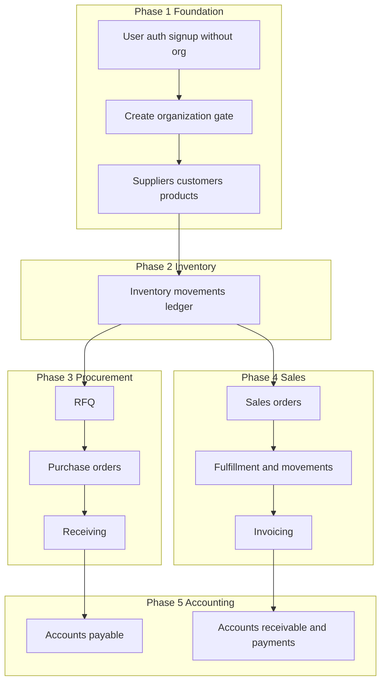

# Development phases and prompts (JMC ERP)

## Ordering rationale

Build **bottom-up** so documents and stock hooks land on stable foundations—matching [jmc-erp-vertical-slice](.cursor/skills/jmc-erp-vertical-slice/SKILL.md) and [docs/data-model.md](docs/data-model.md).

**Procurement flow** ([procurement.md](docs/flows/procurement.md)): RFQ → PO → Receiving → inventory movements + AP.

**Sales flow** ([sales.md](docs/flows/sales.md)): Sales order → inventory movements → invoice → AR → payment.

**Product principles** ([product-overview.md](docs/product-overview.md)): tenant isolation; inventory via **movements**; thin Livewire, rich services.

---

## Tenancy onboarding flow (locked-in product decision)

Registration and organization creation are **decoupled**:

1. **Sign up:** User registers with **email/password only**—no organization name, no `tenant_id` required at account creation (user may have `tenant_id` nullable until they belong to an org, or use a `tenant_user` pivot with zero rows—implementation detail in Phase 1).
2. **Sign in:** User authenticates as today (session/token).
3. **Before main ERP features:** If the user has **no active tenant** (has not created or joined an organization), redirect to an **“Create organization”** step (e.g. name “Cebu Hardware Corp.”). Submitting creates a **`tenants`** row and attaches the user (e.g. owner role).
4. **After org exists:** Set **tenant context** on the session (or default tenant) and allow access to dashboard, procurement, inventory, etc. All business routes **require** a resolved tenant; middleware blocks access until step 3 is complete.

Optional later: invite users to an existing tenant, switcher for users in multiple orgs—out of scope unless added explicitly.

**Prompt template (onboarding slice):**

> Implement post-login **organization onboarding**: `tenants` table + create-organization Livewire screen + middleware that sends users without a tenant to `/organization/create` (or equivalent) and prevents access to ERP routes until `tenant_id` (or membership) is set. User registration remains unchanged (no org fields). Document the flow in [data-model.md](docs/data-model.md) / [technical-architecture.md](docs/technical-architecture.md).

---

## Phase 1 — Platform and CRM master data

**Goal:** **(a)** Auth as above—users without org at signup; **(b)** tenants + membership + onboarding gate; **(c)** tenant isolation and reference entities (suppliers, customers, products) so operational documents have stable FK targets.

**Read first:** [product-overview.md](docs/product-overview.md), [data-model.md](docs/data-model.md), [modules/crm.md](docs/modules/crm.md), [technical-architecture.md](docs/technical-architecture.md).

**Prompt template (copy and customize):**

> Implement [specific feature: e.g. tenant-scoped suppliers CRUD] for JMC ERP. Follow `.cursor/rules/` (erp-project-context, erp-architecture, erp-laravel-livewire) and [development-conventions.md](docs/development-conventions.md). Every tenant-owned table includes `tenant_id` with FK and indexes. Use migration → model → policy → form request → service → Livewire; place domain code under `app/Domains/` as appropriate. Do not add inventory quantity hacks—only master data here.

---

## Phase 2 — Inventory ledger (movements)

**Goal:** **Inventory movements** as the authoritative stock change log before tying heavy operational UIs ([product-overview.md](docs/product-overview.md) “Operational truth”).

**Read first:** [modules/inventory.md](docs/modules/inventory.md), [data-model.md](docs/data-model.md) (inventory movements section).

**Prompt template:**

> Implement [e.g. inventory movement types, posting helper, or adjustment flow] using **inventory_movements** as the only path for quantity changes. Wrap multi-step writes in DB transactions. Align with [jmc-erp-vertical-slice](.cursor/skills/jmc-erp-vertical-slice/SKILL.md) done checklist. Update [data-model.md](docs/data-model.md) if schema meaningfully changes.

---

## Phase 3 — Procurement vertical slice

**Goal:** MVP procurement: RFQ, PO, receiving that creates movements and supports AP handoff ([mvp-scope.md](docs/mvp-scope.md), [flows/procurement.md](docs/flows/procurement.md)).

**Read first:** [modules/procurement.md](docs/modules/procurement.md), [flows/procurement.md](docs/flows/procurement.md).

**Prompt template:**

> Implement [RFQ / PO / receiving step] end-to-end: migration through Livewire. **Receiving** must create **inventory movements** in the same transaction as the receipt document—not silent stock bumps ([procurement flow notes](docs/flows/procurement.md)). Prepare AP traceability to documented procurement activity where applicable ([modules/accounting.md](docs/modules/accounting.md) as needed).

---

## Phase 4 — Sales vertical slice

**Goal:** Sales orders, fulfillment that issues stock via movements, invoicing path ([flows/sales.md](docs/flows/sales.md)).

**Read first:** [modules/sales.md](docs/modules/sales.md), [flows/sales.md](docs/flows/sales.md).

**Prompt template:**

> Implement [sales order / shipment / invoice step] per [sales.md](docs/flows/sales.md). Inventory impact only through **inventory movements**. Invoicing should connect to AR per accounting policy; use services and transactions for document + lines + movements.

---

## Phase 5 — Accounting (AP / AR) and payments

**Goal:** AP aligned with procurement/receiving; AR and payments aligned with issued invoices ([mvp-scope.md](docs/mvp-scope.md), [modules/accounting.md](docs/modules/accounting.md)).

**Prompt template:**

> Implement [AP posting from matched supplier invoice / AR from customer invoice / payment allocation] with tenant scoping, policies, and transactional consistency. Trace links to operational documents where [accounting.md](docs/modules/accounting.md) specifies.

---

## Phase 6 — Integration, API, and hardening

**Goal:** Cross-module consistency, [api-outline.md](docs/api-outline.md) if exposing HTTP API, QA on full flows, N+1 and performance ([development-conventions.md](docs/development-conventions.md)).

**Prompt template:**

> [Harden / add API for / test] [feature]: enforce tenant context on every request for APIs; verify end-to-end [procurement | sales] flow from [flows/README.md](docs/flows/README.md); eager-load list views; add or extend tests for edge cases (concurrent posting, invalid state transitions).

---

## Meta-prompt (every phase)

Attach this to any phase-specific prompt so agents stay consistent:

> Apply the **jmc-erp-vertical-slice** skill: read the listed `docs/` files first; implementation order migration → model → policy → form request → service → UI; stock changes only via movements when applicable.

---

## Suggested deliverable in the repo

After you approve this plan, add a single doc (for example [`docs/development-phases.md`](docs/development-phases.md)) containing: the phase table, the dependency diagram (or a short prose order), and the prompt templates above expanded with 1–2 **concrete example prompts** per phase (e.g. “Create RFQ with line items” vs generic placeholders). No code changes unless you later ask to scaffold features.
