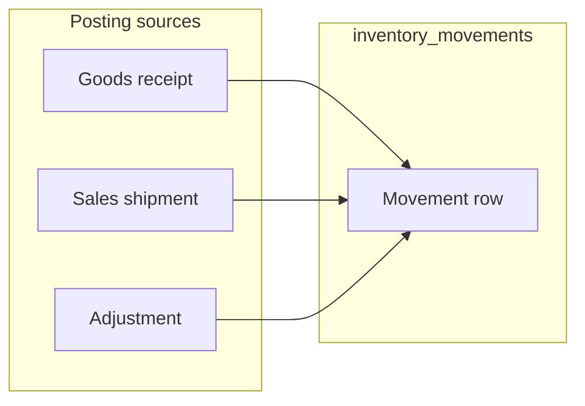

# Inventory movements: professional UI features

## Current state

The Livewire page at [`resources/views/pages/inventory/movements/index.blade.php`](resources/views/pages/inventory/movements/index.blade.php) loads tenant-scoped [`InventoryMovement`](app/Models/InventoryMovement.php) rows with `product`, ordered `latest()`, paginated 20 per page. Columns: **When**, **Product**, **Type**, **Quantity**, **Notes**.

The table [`inventory_movements`](database/migrations/2026_04_11_000004_create_inventory_movements_table.php) includes **`reference_type` / `reference_id`** (morph to source lines such as goods receipt or shipment lines—see [`PostInventoryMovementService`](app/Domains/Inventory/Services/PostInventoryMovementService.php)). **That reference is not shown in the UI today**, which is the largest gap versus a typical ERP movement log.

---

## Features that are “necessary” for a credible module

These are what finance, ops, and auditors usually expect from a **stock ledger** screen:

1. **Source traceability (high priority)**  
   Show *why* each line exists: link or label for the originating document/line (receipt, shipment, manual adjustment). You already persist `reference`; the UI should resolve the morph (e.g. parent PO number, order number) and link to the relevant show page where routes exist. Adjustments with no reference stay as “Adjustment” or similar.

2. **Filtering and scoped views**  
   At minimum: **date range**, **movement type** (receipt / issue / adjustment / transfer per [`InventoryMovementType`](app/Enums/InventoryMovementType.php)), and **product** (search by name or SKU—[`Product`](app/Models/Product.php) has `sku`). Optional: quick presets (“Last 7 days”, “This month”).

3. **Scanability and semantics**  
   - **Type styling**: distinct badge colors (e.g. inbound vs outbound vs neutral).  
   - **Signed quantity**: display issues/adjustments in a way that matches business meaning (many ERPs show +/− or separate “in” and “out” columns). Align with how you interpret `quantity` for each type in posting code.  
   - **Product column**: show **SKU** (and name) so rows are identifiable without opening the product.

4. **Sort control**  
   Default newest-first is fine; allow **sort by date** (asc/desc) and optionally **quantity** or **product** for reconciliation workflows.

5. **Audit and handoff**  
   **Export** (CSV at least) of the **filtered** result set with the same columns you show plus reference/source—used by accounting and inventory analysis outside the app.

6. **Permissions and safety**  
   Keep [`Gate::authorize('viewAny', InventoryMovement::class)`](resources/views/pages/inventory/movements/index.blade.php) consistent with policies. The ledger is normally **read-only**; “Record adjustment” already routes to [`inventory.adjustments.create`](resources/views/pages/inventory/adjustments/create.blade.php).

---

## Strongly valuable but often phase-2

- **Product-centric ledger**: same movements constrained to one product with **running balance** after each row. Usually a dedicated view or filter (“Product ledger”) because a global list does not imply a single running total without a product (or location) scope.
- **User / actor** who posted the movement (`user_id` or `created_by`) — **not** in the current migration; add if you need accountability comparable to audit logs.
- **Location / warehouse / bin** — **not** in schema today; only relevant after you model multi-location inventory.
- **Cost per movement / valuation** — depends on your costing model; not on `inventory_movements` as defined now.

---

## Implementation direction (when you move from planning to build)

- **No schema change** for: filters, sort, badges, SKU column, export of existing fields, **displaying and linking `reference`** (may need small presenter/service to turn `reference_type` + `reference_id` into labels and URLs per model).
- **Schema / domain work** later if you add: posted-by user, locations, lots, or unit cost on movements.

---

## Summary

The single most important professional upgrade for your current codebase is **exposing source traceability** using the existing polymorphic reference, combined with **filters**, **clear type/quantity presentation**, and **CSV export** of the filtered ledger. That aligns the UI with how procurement and sales already post movements in transactions, without requiring new tables for a first improvement pass.
