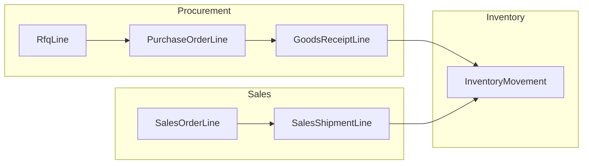

# Product 360: lifecycle, analytics, and reorder alerts

## Current state (repo facts)

- **Products** are master data only ([`app/Models/Product.php`](app/Models/Product.php)); **on-hand** is `SUM(inventory_movements.quantity)` per tenant (see [`docs/data-model.md`](docs/data-model.md)).
- **Only list route** exists: [`routes/web.php`](routes/web.php) registers `products.index`; there is **no product show page** yet ([`resources/views/pages/products/index.blade.php`](resources/views/pages/products/index.blade.php)).
- **Movement provenance** is already partially solved: [`ResolveInventoryMovementSourceLinkService`](app/Domains/Inventory/Services/ResolveInventoryMovementSourceLinkService.php) resolves links from `GoodsReceiptLine` → PO and `SalesShipmentLine` → SO for the inventory movements UI pattern.
- **Traceability chain in data**: `RfqLine` → optional `PurchaseOrderLine.rfq_line_id` → `GoodsReceiptLine` → `InventoryMovement` (receipt); `SalesOrderLine` → `SalesShipmentLine` → `InventoryMovement` (issue). RFQs do **not** post stock; they are **pre-PO** context.

## Recommended UX structure (single page)

| Zone | Purpose |
|------|---------|
| **Header** | Name, SKU, on-hand (big number), reorder status badge if below threshold |
| **KPI strip** | On-hand; **incoming** (open PO qty not yet received); **committed** (open SO qty not yet shipped); optional **available** if you later add reservations |
| **Charts** | Time-range selector (7d / 30d / 90d / YTD / custom) shared across charts |
| **Tab or stacked sections** | **Lifecycle activity** (unified timeline); **Inventory ledger** (movements table, filtered to this product—reuse list patterns from [`resources/views/pages/inventory/movements/index.blade.php`](resources/views/pages/inventory/movements/index.blade.php)); **Procurement** and **Sales** sub-tables if the timeline is too dense |

## Backend design

### 1) Schema: reorder / minimum quantity

- Add nullable **`reorder_point`** (decimal, same precision as movements) on **`products`**—industry term clearer than “minimum quantity” alone; you can label the UI “Minimum / reorder level.”
- Optional: **`reorder_qty`** (suggested order quantity when below point) for later PO drafts—skip in MVP unless you want it now.

**Policy + validation**: extend [`ProductPolicy`](app/Policies/ProductPolicy.php) if needed; use a Form Request or validated Livewire action for updates (mirror [`StoreProductRequest`](app/Http/Requests/StoreProductRequest.php) patterns).

### 2) Services (thin Livewire)

Introduce domain services under [`app/Domains/Inventory/`](app/Domains/Inventory/) (or a small `ProductAnalytics` namespace if you prefer separation):

- **`BuildProductActivityTimelineService`** — returns a **sorted list of DTOs** (`occurred_at`, `category`: `rfq|po|receipt|movement|sales_order|shipment|invoice|adjustment`, `title`, `subtitle`, `url`, `quantity`, `amount` optional). Sources:
  - RFQ lines joined to `rfqs` (use `sent_at` or `created_at` as fallback for ordering)
  - PO lines joined to `purchase_orders` (`order_date` / `created_at`)
  - Posted goods receipts / lines (`received_at`)
  - `inventory_movements` for this `product_id` (reuse labels via existing resolver where applicable)
  - Sales order lines (`sales_orders.order_date`), shipments (`shipped_at`), issued invoice lines (`issued_at`)
- **`GetProductStockKpisService`** — on-hand; **incoming** = sum of `(quantity_ordered - received)` for non-cancelled POs using existing helpers like `PurchaseOrderLine::totalReceivedQuantity()` ([`app/Models/PurchaseOrderLine.php`](app/Models/PurchaseOrderLine.php)); **committed** = sum of `(quantity_ordered - shipped)` from `SalesOrderLine` + posted shipments (mirror [`totalShippedQuantity`](app/Models/SalesOrderLine.php)).
- **`GetProductChartSeriesService`** — for a date range and tenant:
  - **Inventory trend**: cumulative balance over time from movements ordered by `created_at` (efficient approach: one query for movements in range + carry-in balance before range start in one aggregate query).
  - **Purchase price trend**: time series of **effective unit_cost** from PO lines (point per line or per receipt date if you want “landed at receipt”—MVP: PO line at `order_date`).
  - **Sale price trend**: time series from **sales order lines** (`unit_price` vs `sales_orders.order_date`) or **invoice lines** if you want billed price (document the choice; invoice is closer to AR reality).

All queries **`where tenant_id = session tenant`** and `product_id = :id`.

### 3) Routing and authorization

- Add `Route::livewire('products/{id}', ...)->name('products.show')` next to [`routes/web.php`](routes/web.php) products routes.
- `mount`: load product scoped by tenant; `Gate::authorize('view', $product)`.

### 4) UI / charts

- **No chart library in [`package.json`](package.json)** today—add **`chart.js`** (and optionally **`chartjs-adapter-date-fns`** if you use time axes) via npm, expose a small Vite entry or Alpine/Livewire hook that receives **JSON series from Livewire** (`@json` in Blade). Keep chart config in a dedicated Blade partial or a tiny JS module to avoid bloating the Livewire class.
- Match existing **Flux** layout/cards ([`resources/views/pages/products/index.blade.php`](resources/views/pages/products/index.blade.php), procurement/sales show pages) for visual consistency.

### 5) Low-stock notification (MVP vs phase 2)

- **MVP (in-app)**: On product page, show **Flux callout** when `on_hand <= reorder_point` (and `reorder_point` is not null). Optionally show a **badge** on the products list row (requires list query to compute or a computed accessor)—keep list change minimal unless you want it.
- **Phase 2 (async)**: Laravel **scheduled command** per tenant: find products where `on_hand <= reorder_point`, dispatch **database or mail notifications** to users with inventory permissions. Requires notification classes, queue config, and idempotency (e.g., notify once per day or per threshold crossing). Defer unless you explicitly need email/push now.

## Market-standard features worth including (prioritized)

**High value, fits your schema now**

- **Supply snapshot**: on-hand, **incoming** (open PO), **committed** (open SO)—answers “can we fulfill?” without opening five screens.
- **Full document drill-down**: every timeline row links to RFQ / PO / GR / SO / shipment / invoice (you already have PO and SO links from movements; extend the same idea for non-movement rows).
- **Price history**: purchase unit cost over time vs **sales unit price** over time (two series or dual-axis chart); optional **gross margin %** row in a table when both exist for the same period.
- **Last movement / last receipt / last sale** quick facts (dates + quantities).

**Medium value (next iterations)**

- **Average / moving average cost** from receipts (weighted by quantity)—foundation for margin and inventory valuation reports ([`docs/modules/inventory.md`](docs/modules/inventory.md) already mentions valuation policies).
- **Lead time**: average `received_at - purchase_orders.order_date` per product-supplier (needs aggregation service).
- **Turnover / days on hand** (needs cost of goods or usage over period—ties to accounting module maturity).
- **Min–max or EOQ** fields once you have stable demand history.

**Usually separate modules (call out, don’t bundle into v1)**

- Lot/serial traceability, multi-warehouse bins, **BOM/kit** where-used, quality holds, supplier scorecards.

## Testing

- Feature tests: product show **404** for other tenant; **200** with expected KPIs/timeline rows seeded from factories.
- Optional: CSV export of timeline (parity with [`ExportInventoryMovementsCsvService`](app/Domains/Inventory/Services/ExportInventoryMovementsCsvService)) as a follow-up.

## Documentation

- Update [`docs/data-model.md`](docs/data-model.md) when `reorder_point` (and any optional fields) land.

## Suggested delivery phases

1. **MVP**: migration + model + KPIs + unified timeline + three charts + reorder point editor + in-app low-stock callout + `products.show` linked from index.
2. **V2**: scheduled notifications; average cost; lead-time widget; export.
