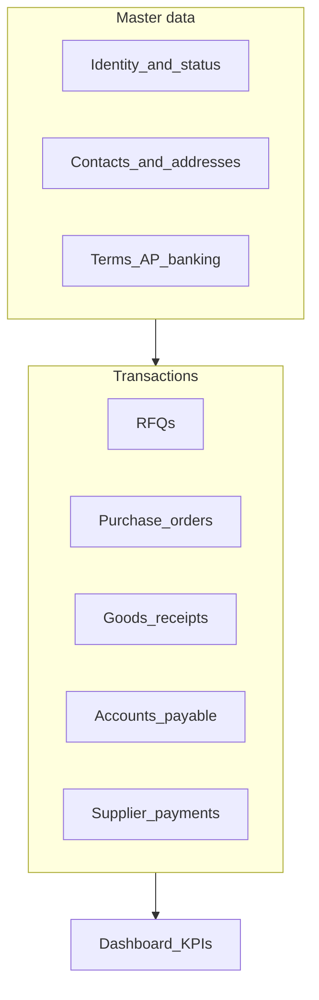

# Supplier single-page spec (ERP-aligned)

## Current baseline in this project

- **Master data:** [`suppliers`](database/migrations/2026_04_11_000005_create_suppliers_table.php) has `name`, `email`, `phone`, `address` (see [`docs/data-model.md`](docs/data-model.md)).
- **Relationships already on [`Supplier`](app/Models/Supplier.php):** `rfqs()`, `purchaseOrders()`.
- **Downstream (not yet on the model but in the domain):** goods receipts and AP flow from POs; [`supplier_payments`](docs/data-model.md) and allocations tie to suppliers.

Use this as the **minimum viable “significant information”** set for one screen, then grow into a fuller dashboard.

---

## 1. Necessary information (most ERPs)

### A. Header / identity

- **Legal / trading name**, any **code** or external ID (for integrations and duplicate control).
- **Status:** active, on hold, blocked (purchasing and payment often respect this).
- **Primary contact** vs. **billing/remittance** contact (can be one row at first).

### B. Addresses and communication

- **Registered / billing address** and **ship-to** (if different)—procurement often needs delivery context even when the vendor is remote.
- **Phone, email**, optional **website**.
- **Preferred language** and **timezone** (helpful for multinational vendors).

### C. Commercial and procurement terms

- **Default currency** and **payment terms** (e.g. Net 30)—drives expectations on POs and AP.
- **Default tax / withholding** treatment where applicable (region-specific).
- **Lead time** or **min order** (optional but common on supplier cards).

### D. Banking / AP (accounts payable)

- **Remittance details** (bank account masked in UI, full detail restricted by role).
- **Tax ID / VAT / registration** for invoice matching and compliance.

### E. Activity and documents (the “transactions” half of the page)

Grouped by process stage, each with **date, reference, status, amount** and a link to the document:

| Area | Typical content |
|------|-----------------|
| **Sourcing** | RFQs (you have [`rfqs`](docs/data-model.md)) |
| **Commitments** | Purchase orders by status ([`purchase_orders`](docs/data-model.md)) |
| **Receipts / AP** | Goods receipts (via PO), posted AP lines, **supplier invoice reference** on receipts |
| **Cash** | Supplier payments and allocations ([`supplier_payments`](docs/data-model.md)) |

### F. Financial snapshot (dashboard strip)

- **Open AP** (unpaid or partial), **aging** (current, 30, 60, 90+).
- **YTD purchases** (from POs or posted receipts—define one source of truth).
- Optional: **last order date**, **last payment date**.

---

## 2. Recommended “helpful” features (beyond the minimum)

- **360 layout:** Summary cards at top + **tabs**: Overview | Purchase history | Receipts & AP | Payments | RFQs | Notes/attachments.
- **Quick actions (gated):** New RFQ, New PO, Record payment (reuse patterns from [`purchase-orders/show.blade.php`](resources/views/pages/procurement/purchase-orders/show.blade.php) and accounting flows).
- **Notes and attachments:** Contracts, certificates, price lists; audit trail of who changed terms.
- **Supplier scorecard (later):** On-time delivery %, quality issues, price variance vs. PO—averages over last N POs/receipts.
- **Price / item history:** Last paid unit cost per product (from PO lines / receipts)—supports re-negotiation.
- **Duplicate detection:** Warn when creating a supplier with similar name or tax ID.
- **Integration hooks:** External `supplier_code` for future EDI or e-invoicing.

---

## 3. Information architecture (conceptual)

---

## 4. Gaps vs. your schema (if you implement a full page later)

- **Today:** supplier record is intentionally minimal; **status**, **codes**, **terms**, **tax ID**, and **bank fields** would need migrations if you want parity with standard ERP cards.
- **Queries:** Eager-load POs → goods receipts → AP; payments and allocations by `supplier_id`—all tenant-scoped per your rules.

---

## 5. Suggested priority for a first version

1. **Header + contact** (existing fields) + **status** (even a simple enum).
2. **Tabbed lists:** RFQs, POs (with status/date), drill-down to existing show routes.
3. **Financial strip:** open AP + recent payments (from existing accounting models).
4. **Notes** (simple text on `suppliers` or a polymorphic notes table).
5. **Later:** scorecard, attachments, extended commercial master data.

This gives you a single supplier page that matches what users expect from NetSuite/SAP BC/Dynamics **vendor cards**: identity and terms on top, operational and financial history below, with clear paths into documents you already model.
