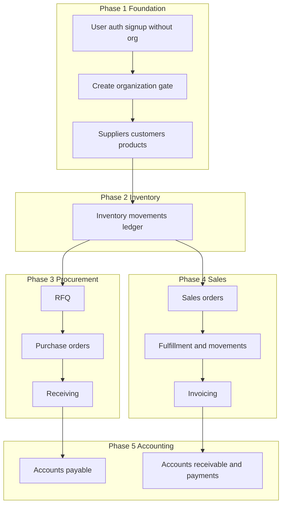

# Development phases and prompts (JMC ERP)

Ordered phases align with [product overview](product-overview.md), [MVP scope](mvp-scope.md), procurement and sales [flows](flows/README.md), and [data model](data-model.md). Use the prompt templates when delegating work to agents or teammates; attach the [meta-prompt](#meta-prompt-every-phase) when helpful.

## Ordering rationale

Build **bottom-up** so documents and stock hooks land on stable foundations—matching the [jmc-erp-vertical-slice](../.cursor/skills/jmc-erp-vertical-slice/SKILL.md) skill and the data model.

**Procurement flow** ([procurement.md](flows/procurement.md)): RFQ → PO → Receiving → inventory movements + AP.

**Sales flow** ([sales.md](flows/sales.md)): Sales order → inventory movements → invoice → AR → payment.

**Product principles** ([product-overview.md](product-overview.md)): tenant isolation; inventory via **movements**; thin Livewire, rich services.

---

## Tenancy onboarding flow (product decision)

Registration and organization creation are **decoupled**:

1. **Sign up:** User registers with **email/password only**—no organization at signup (`tenant_user` empty until they create or join an org).
2. **Sign in:** Normal session authentication.
3. **Before main ERP features:** If the user has **no organization membership**, redirect to **Create organization** (e.g. name “Cebu Hardware Corp.”). Submitting creates a **`tenants`** row and attaches the user (e.g. owner role on `tenant_user`).
4. **After org exists:** **Current tenant** is stored in session; dashboard and future ERP routes require a valid tenant the user belongs to.

Invites and multi-org switching are optional later scope.

**Example prompt (onboarding slice):**

> Implement post-login **organization onboarding** for JMC ERP: `tenants` table, `tenant_user` pivot with role, create-organization Livewire page at `organization/create`, and middleware so users without any membership cannot access tenant-scoped routes (e.g. dashboard) until they create an organization. Keep Fortify registration unchanged (no org fields). Document in [data-model.md](data-model.md) and [technical-architecture.md](technical-architecture.md).

---

## Phase 1 — Platform and CRM master data

**Goal:** (a) Auth without org at signup; tenants + membership + onboarding gate; (b) tenant isolation and reference entities (suppliers, customers, products).

**Read first:** [product-overview.md](product-overview.md), [data-model.md](data-model.md), [modules/crm.md](modules/crm.md), [technical-architecture.md](technical-architecture.md).

**Example prompts:**

> Add **tenant-scoped suppliers** end-to-end: migration (`suppliers` with `tenant_id` FK), `Supplier` model, policy, form request, `CreateSupplier` / `UpdateSupplier` services, Livewire index and form under `app/Domains/Crm/` or equivalent. List views eager-load; all queries scoped by current session tenant.

> Seed or factory **products** per tenant for local QA only; no silent stock fields—quantities will come from **inventory movements** in Phase 2.

---

## Phase 2 — Inventory ledger (movements)

**Goal:** **Inventory movements** as the authoritative stock change log ([product overview](product-overview.md) “Operational truth”).

**Read first:** [modules/inventory.md](modules/inventory.md), [data-model.md](data-model.md).

**Example prompts:**

> Create **`inventory_movements`** (with `tenant_id`, product reference, quantity, movement type, reference document nullable) plus a `PostInventoryMovement` service that runs inside a DB transaction. Forbid updating quantity on `products` without a movement row.

> Add an **adjustment** Livewire flow that only calls the posting service (no direct `Product::increment`).

---

## Phase 3 — Procurement vertical slice

**Goal:** MVP procurement: RFQ, PO, receiving with movements and AP handoff ([mvp-scope.md](mvp-scope.md), [flows/procurement.md](flows/procurement.md)).

**Read first:** [modules/procurement.md](modules/procurement.md), [flows/procurement.md](flows/procurement.md).

**Example prompts:**

> Implement **purchase orders** with line items (product, qty, price); status transitions via a service. No inventory change until receiving.

> Implement **goods receipt** posting: one transaction creates receipt document lines and matching **inventory movements** for received quantities ([procurement flow](flows/procurement.md)). Prepare nullable FK hooks toward AP documents as needed.

---

## Phase 4 — Sales vertical slice

**Goal:** Sales orders, fulfillment via movements, invoicing ([flows/sales.md](flows/sales.md)).

**Read first:** [modules/sales.md](modules/sales.md), [flows/sales.md](flows/sales.md).

**Example prompts:**

> Build **sales order** CRUD with lines; fulfillment/shipment step that creates **issue** movements in the same transaction as the shipment record.

> Add **customer invoice** issuance that creates or updates **AR** placeholders per [modules/accounting.md](modules/accounting.md); inventory already handled at fulfillment.

---

## Phase 5 — Accounting (AP / AR) and payments

**Goal:** AP with procurement; AR and payments with sales invoices ([mvp-scope.md](mvp-scope.md), [modules/accounting.md](modules/accounting.md)).

**Example prompts:**

> Post **supplier invoice** matched to PO/receipt with tenant-scoped AP line items; payment allocation clears open AP in one transaction.

> Record **customer payment** against open AR from issued sales invoices; validate amounts and tenant.

---

## Phase 6 — Integration, API, and hardening

**Goal:** Consistency across modules, [api-outline.md](api-outline.md) if exposing HTTP APIs, tests, performance ([development-conventions.md](development-conventions.md)).

**Example prompts:**

> Add API routes for **supplier list** with `tenant_id` from authenticated context, pagination, and consistent JSON errors per [api-outline.md](api-outline.md).

> Profile N+1 on procurement PO index; add indexes for list filters; add feature tests for concurrent receipt posting (expect transaction rollback on failure).

---

## Meta-prompt (every phase)

Attach when you want strict alignment with project rules:

> Apply the **jmc-erp-vertical-slice** skill: read the listed `docs/` files first; implementation order migration → model → policy → form request → service → UI; stock changes only via **inventory movements** when applicable; `tenant_id` on all new tenant-owned tables.

---

## Related documentation

| Topic | Location |
|-------|----------|
| Conventions | [development-conventions.md](development-conventions.md) |
| MVP | [mvp-scope.md](mvp-scope.md) |
| Data & tenancy | [data-model.md](data-model.md), [technical-architecture.md](technical-architecture.md) |
