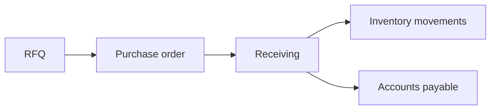

# Procurement flow

## Narrative

Sourcing leads to a **purchase order**. **Receiving** confirms what arrived and drives **inventory** increases. Supplier obligations roll into **accounts payable** when invoices are matched and approved.

## Diagram

## Implementation notes

- Receiving should create **inventory movements** (not silent stock bumps).
- AP entries should trace to **documented** procurement activity where possible.
