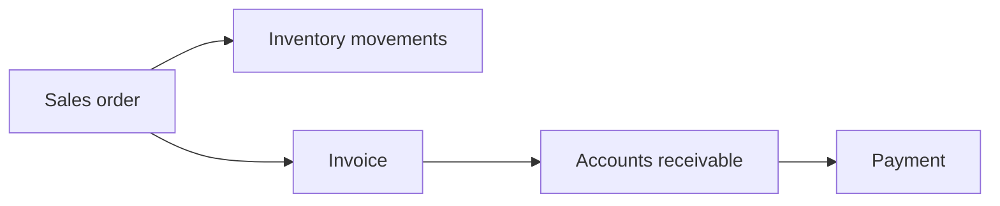

# Sales flow

## Narrative

A **sales order** reserves or commits product according to your rules. Fulfillment drives **inventory** issues. **Invoicing** establishes **accounts receivable**, and **payments** clear AR.

## Diagram

## Implementation notes

- Inventory impact should flow through **inventory movements** for traceability.
- AR should align with **issued invoices** and recognized revenue rules as defined by accounting policy.
